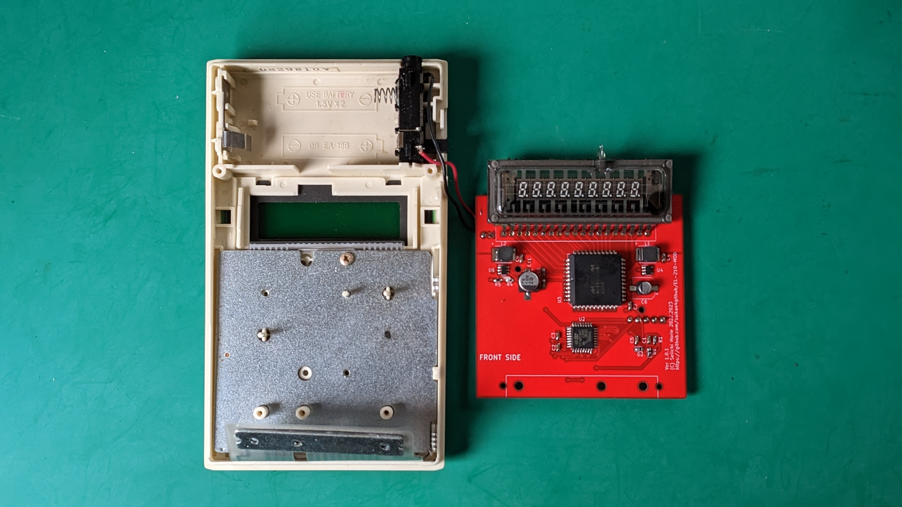
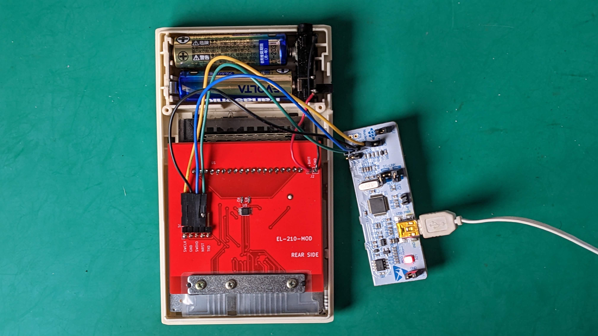
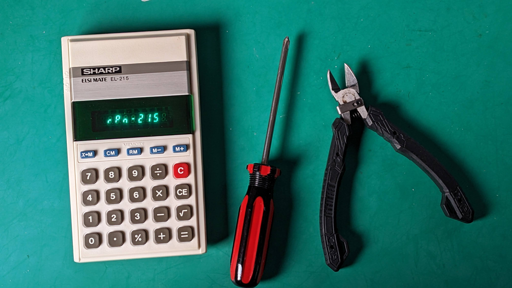

# EL-210-MOD
Alternative circuit for SHARP EL-210/EL-215 calculator

# Description

This is a circuit/board design for the alternate PCB for the SHARP EL-210/215 calculators. SHARP EL-210 series are manufactured around early 1980th. 
By using this alternate PCB, you can program any program as firmware of this
classic VFD calculator. 

There is an dedicated RPN firmware is located in the [rpn2026](https://github.com/suikan4github/rpn2026) project.

To make your own RPN calculator,
user must follow the procedure : 
1. Take the main board of the EL-210 out. 
1. Move the VFD from the old board to this board. 
1. Set this board into the EL-210 calculator. 
1. Program the board with the appropriate RPN firmware. 

# Circuit Design

You can found additional design resources : 
- [Schematic diagram](doc/EL-210-MOD.pdf).
- [Parts list](doc/partslist.csv).

## VFD specification
The VFD is 9-ST-20, manufactured by Futaba. The specification is not disclosed. 
Pin assignment has been investigated by [LI2026ODP](https://github.com/suikan4github/LI2026ODP/wiki/LI2026A) project.
- Anode voltage : 25V
- Heater voltage : 2.5v (Differential square wave drive), 21mA. 
- Grid cutoff : 4V

## Heater driver
The heater must be driven by differential alternate current. This is required to make the flat brightness between right-end and left-end of the VFD. If you drive 
the heater by DC, the voltage slope of the heater will make the slop of the brightness.

The analog switch provide the low voltage drop out current switching. The timing
is made by MCU timer.

## Grid bias 
The grid bias is required 4. Because the balanced drive of the heater makes
1.65V grid bias, we need only 2.5V more. 

## Key matrix
The key matrix has been investigated by also [LI2026ODP](https://github.com/suikan4github/LI2026ODP/wiki/KeyMatrix) project. 

The EL-21x series key matrix doesn't have any protection diode. Thus, to prevent the signal shortage,
the GPIO pins for the key matrix have to be configured : 
- Row : Open Drain output.
- Col : Input with pull-up register. 

To check the button pushed, output the "L" from the Row.
If the Column get "L", the button is pushed. 

|  Row  | Column 0  |  Column 1  |  Column 2  |
| :---: | :---:     | :---:      | :---:      |
|   0   |   CE      |  X->M      |   0        |
|   1   |           |   7        |   4        |
|   2   |   CM      |   8        |   1        |
|   3   |   .       |   5        |   %        |
|   4   |   +       |   RM       |   2        |
|   5   |   C       |   9        |   =        |
|   6   |   /       |   M-       |            |
|   7   |   *       |   6        |   3        |
|   8   |   -       |   M+       |  sqrt      |

## 24V
To supply the 24V to VFD, set EN24 signal to "H".

# Caution
In the case you order the PCB to a board manufacturer, you must specify the 
PCB thinness as 1.0mm. The standard 1.3mm is too thick. 

# Known Problems
The Grid bias is not deep as expected. It is -0.9V while expected -2.5v. 
It is left untouched because it is not problematic. 

# Gallery

